# Station Abyssale‑6

**Station Abyssale‑6** est un jeu d’aventure textuel immersif, mêlant exploration, collecte d’objets, interactions avec des personnages non‑joueurs (PNJ) et résolution d’énigmes.  
Vous incarnez un survivant dans une station de recherche sous‑marine en perdition à 1 000 mètres de profondeur. Votre objectif : rétablir le courant avant que l’oxygène ne s’épuise.


---

## ✨ Fonctionnalités

- **Carte étendue** : 13 salles interconnectées avec sorties directionnelles (Nord, Sud, Est, Ouest, Haut, Bas).
- **Système d’inventaire** : poids maximal, objets à collecter, échanges avec PNJ.
- **Personnages dynamiques** :
  - PNJ fixes et mobiles (déplacements aléatoires, suivis de chemin ou poursuite du joueur).
  - Dialogues et échanges d’objets (donner/recevoir).
- **Objets spéciaux** :
  - **Téléporteur (Beamer)** : mémorise une pièce et y retourne.
  - **Cookie magique** : augmente la capacité de transport.
  - **Torche** : éclaire et déclenche un easter egg.
  - **Combinaison de plongée, cartes d’accès, clé anglaise…**
- **Portes verrouillables** : nécessitent des objets spécifiques pour être ouvertes/fermées.
- **Salle Transporteur** : téléportation aléatoire dans une autre pièce (mode test déterministe disponible).
- **Puzzle final** : panneau de commande du réacteur avec voltmètre analogique – trouver la bonne combinaison d’interrupteurs.
- **Sauvegarde XML** : exportez et reprenez votre partie à tout moment.
- **Musique et effets sonores** : ambiance sous‑marine, bruitages d’objets, alarme de fin de temps.
- **Minuteur** : 10 minutes pour réussir – Game Over si le temps expire ou si le puzzle échoue.
- **Internationalisation** : support de l’anglais, français, allemand, chinois.
- **Interface graphique moderne** : images en fondu, overlays d’objets/personnages, popups interactives.

---

## 🖼️ Captures d’écran

<div align="center">
  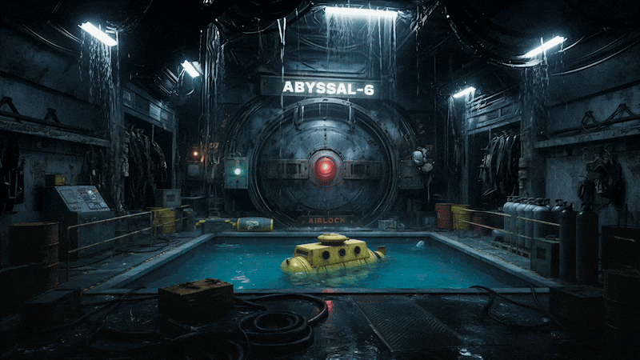
  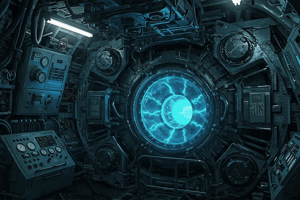
</div>

---

## 🚀 Installation et lancement

### Prérequis

- Java 21 ou supérieur
- Un fichier JAR exécutable (`game.jar`)

### Lancement

```bash
java -jar game.jar
```

> **Note** : Si vous lancez depuis un IDE, assurez‑vous que le répertoire `audio/`, `images/`, `items/`, `characters/` et `messages/` est dans le classpath.

---

## 🎮 Comment jouer

### Objectif

1. Explorez les 13 salles de la station.
2. Collectez des objets (cartes, combinaison, clé anglaise, torche…).
3. Échangez avec les PNJ pour obtenir des objets manquants.
4. Déverrouillez les portes et progressez jusqu’à la salle du réacteur.
5. Résolvez le puzzle électrique pour rétablir le courant.

### Commandes

| Commande            | Description                                                     |
| ------------------- | --------------------------------------------------------------- |
| `go <direction>`    | Se déplacer (nord, sud, est, ouest, haut, bas).                 |
| `look`              | Réafficher la description de la pièce.                          |
| `take <objet>`      | Ramasser un objet dans la pièce.                                |
| `drop <objet>`      | Déposer un objet de l’inventaire dans la pièce.                 |
| `inventory` / `inv` | Afficher l’inventaire détaillé (poids, objets).                 |
| `eat <objet>`       | Consommer un objet comestible (ex. cookie magique).             |
| `use <objet>`       | Utiliser un objet (clé sur une porte, torche, etc.).            |
| `charge`            | Charger le téléporteur (Beamer) avec la pièce actuelle.         |
| `fire`              | Se téléporter vers la pièce mémorisée par le Beamer.            |
| `talk [nom]`        | Parler à un PNJ (sans nom : popup de sélection).                |
| `give <objet>`      | Donner un objet à un PNJ (popup si seul `give`).                |
| `back`              | Revenir à la pièce précédente (si accessible).                  |
| `help`              | Afficher l’aide.                                                |
| `save <nom>`        | Sauvegarder la partie en XML (dans `saves/`).                   |
| `load <nom>`        | Charger une partie XML.                                         |
| `test <fichier>`    | Exécuter un script de test (fonctionnalité développeur).        |
| `lang <code>`       | Changer la langue (`en`, `fr`, `de`, `zh`).                     |
| `alea <salle>`      | (Mode test) Force une destination pour les salles Transporteur. |
| `quit`              | Quitter le jeu (avec confirmation).                             |

### Stratégies

- **Explorez méthodiquement** chaque salle, notez les portes verrouillées et les objets manquants.
- **Échangez avec les PNJ** : certains objets sont nécessaires pour avancer.
- **Gérez votre poids** : le cookie magique augmente votre capacité de transport.
- **Chargez le Beamer** dans des salles stratégiques pour revenir rapidement.
- **Utilisez la torche** dans la salle d’observation (pont) pour un easter egg.

---

## 📦 Objets

| Image                                                          | Objet                  | Utilité                                                     |
| -------------------------------------------------------------- | ---------------------- | ----------------------------------------------------------- |
| 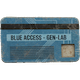    | Carte bleue            | Déverrouille certaines portes (ex. serre).                  |
| 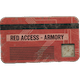     | Carte rouge            | Déverrouille la porte des machines.                         |
| 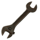       | Clé anglaise           | Déverrouille l’accès au réacteur.                           |
|   | Combinaison de plongée | Permet d’accéder au laboratoire (porte étanche).            |
|       | Échantillon génétique  | Échangeable contre la combinaison de plongée.               |
| 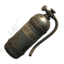       | Bouteille d’oxygène    | Échangeable contre le cookie magique.                       |
|      | Trousse de secours     | Donnée par l’infirmière, échangeable contre la carte rouge. |
| 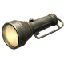        | Torche                 | Éclaire (easter egg dans la salle d’observation).           |
| 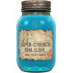 | Cookie magique         | Augmente la capacité de transport de +13 kg.                |
| 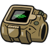       | Téléporteur (Beamer)   | Mémorise une pièce (`charge`) et y retourne (`fire`).       |

---

## 👥 Personnages (PNJ)

| Image                                                                      | PNJ               | Localisation            | Échange / Rôle                                 |
| -------------------------------------------------------------------------- | ----------------- | ----------------------- | ---------------------------------------------- |
| 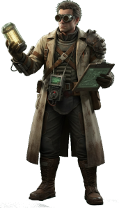      | Scientifique      | Laboratoire             | Beamer ↔ Bouteille d’oxygène                   |
| 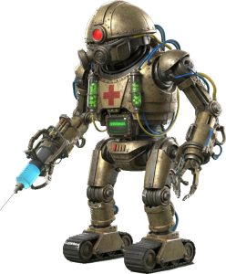         | Médecin           | Infirmerie              | Oxygène ↔ Cookie magique                       |
| 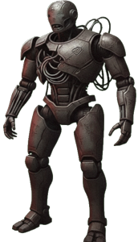          | Garde             | Poste de garde          | Torche ↔ Carte bleue                           |
| 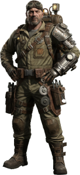       | Ingénieur         | Serre                   | Échantillon génétique ↔ Combinaison de plongée |
|           | Infirmière        | Infirmerie              | Carte bleue ↔ Trousse de secours               |
| 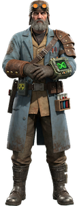     | Génétiste         | Hydroponics             | Trousse de secours ↔ Carte rouge               |
| 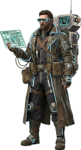 | Technicien errant | Mobile (aléatoire)      | Réagit à la clé anglaise                       |
| 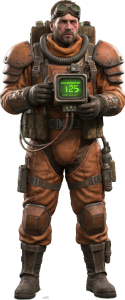     | Chercheur         | Mobile (chemin fixe)    | Réagit à la clé anglaise                       |
|         | Stalker           | Mobile (suit le joueur) | Dialogue, ne donne rien (mais suit activement) |

---

## 🧩 Puzzle du réacteur

Avant de gagner, vous devez résoudre un **puzzle électrique** dans la salle du réacteur :

- Un panneau avec 8 interrupteurs.
- Chaque interrupteur active une résistance et une source de tension.
- L’aiguille du voltmètre indique la tension résultante.
- **Solution** : obtenir une tension comprise entre **3,2 V et 3,4 V** (configuration unique).
- Si la tension est incorrecte, vous échouez → **Game Over**.

> 💡 Indice : la bonne configuration correspond à la résolution “manuelle” du circuit (loi des nœuds / Millman).

---

## 🧪 Mode test et sauvegarde XML

### Sauvegarde

La commande `save <nom>` génère un fichier `saves/<nom>.xml` contenant :

- Toutes les pièces (avec leur image associée).
- Les sorties, portes, trappes.
- L’état du joueur (inventaire, historique, poids, pièce courante).
- L’état des personnages mobiles (position, stratégie, chemin).
- Le temps restant.

### Chargement

`load <nom>` restaure intégralement la partie.

### Commandes de test

- `test <fichier>` : exécute une série de commandes depuis un fichier texte.
- `alea <salle>` : force la prochaine téléportation (mode test – désactivable avec `alea` seul).
- `roomis`, `roomhas`, `playerhas`… sont utilisées dans les scripts de validation.

---

## 🌐 Internationalisation

Le jeu supporte quatre langues (fichiers `messages_*.properties`) :

- Français (`fr`)
- Anglais (`en`)
- Allemand (`de`)
- Chinois (`zh`)

Changement à l’exécution : commande `lang fr` (ou `en`, `de`, `zh`).
L’interface graphique et les textes des PNJ sont traduits dynamiquement.

---

## 🎵 Musique et sons

- Musique d’ambiance en boucle : `theme.wav`
- Effets sonores : porte, téléportation, charge, clé acceptée/refusée, compte à rebours, explosion (game over), félicitations (victoire).
- La musique est gérée par la classe `MusicPlayer` (API Java Sound).

---

## 🥚 Easter Egg

Dans la **salle d’observation** (`room_obs`), utilisez la **torche** (`use torch`) :

- Si la batterie de la torche est **≥ 15 %**, une image secrète apparaît (fondu entrant) et la batterie se décharge progressivement.
- Si la batterie est trop faible, un message vous invite à recharger la torche.

---

## 🛠️ Architecture technique (résumé)

- **Modèle MVC** : `GameEngine` (contrôleur), `Room`/`Player`/`Item` (modèle), `GameGUI` (vue).
- **Gestion des commandes** : `Parser` + `CommandWord` enum + classes dédiées (`GoCommand`, `TakeCommand`, …).
- **PNJ** : hiérarchie `Entity` → `Character` → `MovingCharacter`. Stratégies de déplacement par `enum MovementStrategy`.
- **Objets** : base `Item`, sous‑classes `Beamer`, `MagicCookie`, `DivingSuit`, `Torch`, `GenericItem`.
- **Sauvegarde XML** : `GameSaverXML` / `GameLoaderXML` avec gestion des attributs (`image`, `charged`, `room`, etc.).
- **Internationalisation** : classe `Lang` (singleton) + `ResourceBundle`.
- **Interface graphique** : `TransitionPanel` (images en fondu), `OverlayManager` (icônes d’objets/personnages), `InventoryPopup`, `CharacterInteractionPopup`, `ReactorPuzzleDialog`.
- **Audio** : `MusicPlayer` (clip boucle + SFX).

---

## 🙏 Crédits et licence

- **Développement** : Alexander KAZAZYAN
- **Conception** : Projet universitaire – IUT, département Informatique
- **Inspirations** : jeux d’aventure textuels classiques (Zork, Colossal Cave), films de science‑fiction
- **Licence** : Projet éducatif – libre d’utilisation pour l’apprentissage

---

<div align="center">
  ⏥ STATION ABYSSALE‑6 · version 3.0.21 · mai 2026 ⏥
</div>
